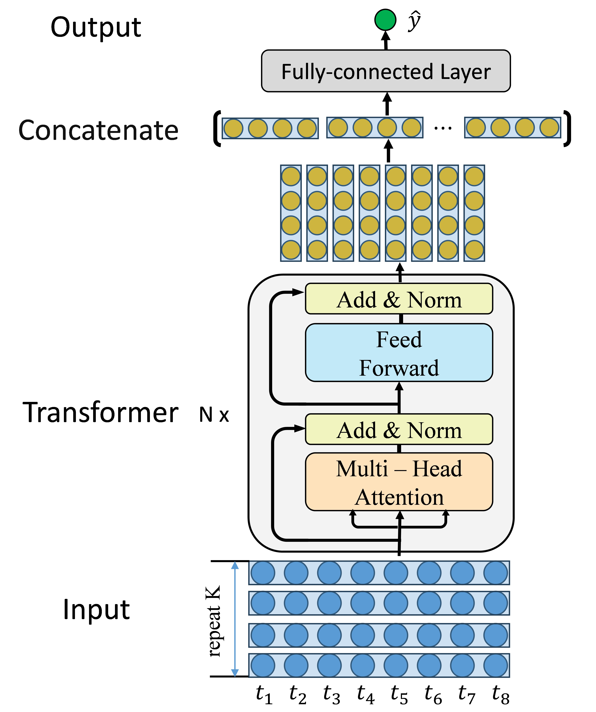

# Figure




# Results


# Supplement

Due to the length of the paper, the two parameters of *dropout* and *noise_level* are not discussed. By setting these two parameters, better results can be obtained than in the paper.

- *noise level = 0.01*: Setting the value of 1% disturbance is best: too large will degrade performance, too small will have little effect.

- *dropout = 1e-4~1e-3*: Set a small value for the network dropout to ensure the robustness of the model.

# Packages

- pytorch 1.8.0

- pandas 0.24.2

- mixture_of_experts 0.2.1 (for AttMoE, github: https://github.com/lucidrains/mixture-of-experts)

# Update

- 6/5/2024, add figures of model and prediction
- 24/2/2022，Change some variable names
- 1/3/2024, upload the open sorce of AttMoE

**Dataset CALCE processing reference**

https://github.com/konkon3249/BatteryLifePrediction

# E-mail

Please feel free to contact me: zhouxiuze@foxmail.com

# More （更多内容）

1. 马里兰大学锂电池数据集 CALCE，基于 Python 的锂电池寿命预测: https://snailwish.com/437/

2. NASA 锂电池数据集，基于 Python 的锂电池寿命预测: https://snailwish.com/395/

3. NASA 锂电池数据集，基于 python 的 MLP 锂电池寿命预测: https://snailwish.com/427/

4. NASA 和 CALCE 锂电池数据集，基于 Pytorch 的 RNN、LSTM、GRU 寿命预测: https://snailwish.com/497/

5. 基于 Pytorch 的 Transformer 锂电池寿命预测: https://snailwish.com/555/

6. 锂电池研究之七——基于 Pytorch 的高斯函数拟合时间序列数据: https://snailwish.com/576/

# Citation
```
@article{chen2022transformer,
  title={Transformer network for remaining useful life prediction of lithium-ion batteries},
  author={Chen, Daoquan and Hong, Weicong and Zhou, Xiuze},
  journal={Ieee Access},
  volume={10},
  pages={19621--19628},
  year={2022},
  publisher={IEEE}
}

@article{chen2024attmoe,
  title={AttMoE: Attention with Mixture of Experts for remaining useful life prediction of lithium-ion batteries},
  author={Chen, Daoquan and Zhou, Xiuze},
  journal={Journal of Energy Storage},
  volume={84},
  pages={110780},
  year={2024},
  publisher={Elsevier}
}
```
